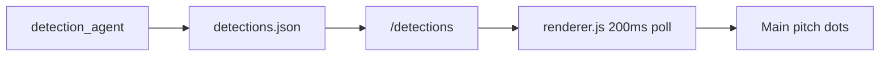

# Overlay Detection, Team Names, and Scenario Detail

## Files

| Fix | File |
|-----|------|
| 1 & 3 (UI) | [`/Users/danish/Documents/ballboy-overlay/renderer.js`](/Users/danish/Documents/ballboy-overlay/renderer.js) |
| 3 (styles) | [`/Users/danish/Documents/ballboy-overlay/styles.css`](/Users/danish/Documents/ballboy-overlay/styles.css) |
| 2 & 3 (API) | [`/Users/danish/Documents/ballboy/simulate_agent.py`](/Users/danish/Documents/ballboy/simulate_agent.py) |

---

## Fix 1 — Live pitch dots from `/detections`

**Current:** [`renderPitch(state)`](file:///Users/danish/Documents/ballboy-overlay/renderer.js) maps `state.lineup` through static `formation433` positions; called from `updateAll` every 2s.

**Change in `renderer.js`:**

1. Add `fetchDetections()` polling `GET http://localhost:5001/detections` every **200ms** (separate from `fetchAll` at 2s).
2. Replace main-pitch dot source with detection bboxes:
   - Center: `cx = (x1 + x2) / 2`, `cy = (y1 + y2) / 2`
   - Normalize: `x = cx / data.width`, `y = cy / data.height` (0–1)
   - Team: `cx < data.width / 2` → `home` (blue `#4a9eff`), else `away` (orange `#ff6b4a`)
3. New `renderPitchFromDetections(data)` clears `.player-dot` only and creates dots via existing `createPlayerDot` (no `player` object → no click popup).
4. **Remove** `renderPitch(state)` call from `updateAll` — match bar / predictions still update from unified state; pitch is detection-driven only.
5. On DOMContentLoaded: start detection poll; initial empty pitch.



**Note:** When `data.total === 0`, pitch stays empty (no `formation433` fallback per spec).

---

## Fix 2 — Dynamic scenario team names

**Current:** [`SCENARIO_SEEDS`](file:///Users/danish/Documents/ballboy/simulate_agent.py) hardcodes Arsenal / Manchester City.

**Change in `simulate_agent.py`:**

1. Replace static `SCENARIO_SEEDS` with `build_scenario_seeds(state)`:
   ```python
   home = state["match"].get("team_home", "Home")
   away = state["match"].get("team_away", "Away")
   home_short = home.split()[0]
   away_short = away.split()[0]
   return [
       f"{home_short} scores a goal",
       f"{away_short} equalizes",
       f"Double substitution for {home_short}",
       f"{home_short} switches to high press",
       "Both teams drop into low block",
       "No major change — stalemate continues",
   ]
   ```
2. In `run_simulate()`, call `seeds = build_scenario_seeds(state)` before spawning threads.
3. Add team names to LLM prompt: `Match: {team_home} vs {team_away}` so returned `title` uses correct clubs.

---

## Fix 3 — Scenario detail panel on mini-pitch click

### Backend (`simulate_agent.py`)

Extend LLM JSON schema and `_fallback_scenario`:

```json
{
  "title": "...",
  "probability": 28,
  "reasons": ["bullet 1", "bullet 2", "bullet 3"],
  "key_stat": "Possession 62% home",
  "snapshots": [...]
}
```

**Fallback** (when LLM fails): derive from `state` — e.g. possession %, goal_probability, minute, tactical_description — produce 3 short reasons and one `key_stat` string.

Validate parsed response includes `reasons` (length 3) and `key_stat`; merge defaults if missing before return.

### Frontend (`renderer.js` + `styles.css`)

1. Store scenarios in module-level `let simulateScenarios = []` inside `renderSimulateGrid`.
2. On each `.mini-pitch` click → `showScenarioDetail(scenario)`:
   - Scenario name (`title`)
   - Probability (`probability`%)
   - `<ul>` of 3 `reasons`
   - Key stat line (`key_stat`)
3. Overlay: fixed full-panel `#scenario-detail-overlay` (hidden by default), created once in JS or added to DOM on first open. Close via X button, backdrop click, or Escape.
4. CSS in `styles.css`: `.scenario-detail-overlay`, `.scenario-detail-card`, `.scenario-detail-title`, `.scenario-detail-prob`, `.scenario-detail-reasons`, `.scenario-detail-key-stat`, `.scenario-detail-close` — match existing dark overlay aesthetic (similar to `.player-popup`).

5. Extend document click handler to also close scenario overlay when clicking outside.

**Mini-pitch** gets `cursor: pointer` in CSS.

---

## Testing

1. Run `detection_agent.py` + `server.py`; open Electron overlay — main pitch dots track screen players at ~5Hz poll (detection ~13fps).
2. Set `unified_state.json` match to Portugal vs Spain; click Simulate — titles reference Portugal/Spain, not Arsenal/City.
3. Click any mini-pitch — detail overlay shows title, %, 3 bullets, key stat.
