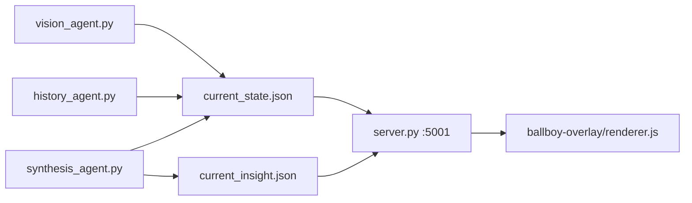
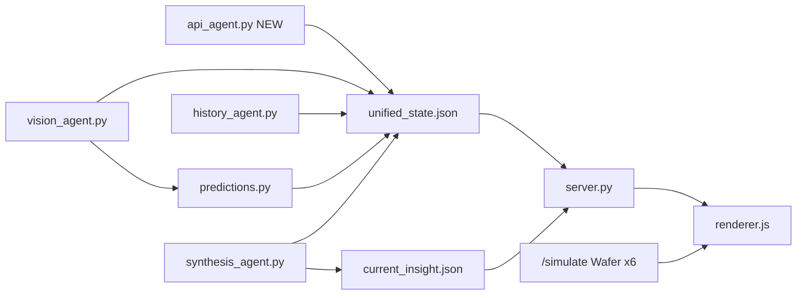

# Premier League Coach AI — Unified State & Overlay Plan

## Current architecture




**Target architecture:**




---

## Phase 1 — Core backend modules (new files)

### 1. `[unified_state.py](unified_state.py)`

Create exactly as specified: threaded `read()` / `write()` / `update()`, `DEFAULT_STATE` with Arsenal/City lineups, `match`, `vision`, `stats`, `lineup`, `prediction`, `possession_history`, `events`.

**Small additions beyond spec (for correctness):**

- Add `fouls_home` / `fouls_away` to `DEFAULT_STATE.stats` (api_agent writes them).
- `read()` should deep-copy `DEFAULT_STATE` on empty/missing file to avoid accidental mutation across agents.

### 2. `[predictions.py](predictions.py)`

Implement the four pure-math functions and `get_all_predictions(unified_state)` exactly as specified (Poisson goal model, empirical sub distribution, shots-on-target model, momentum from `possession_history`).

No LLM imports.

### 3. `[api_agent.py](api_agent.py)`

**HTTP client:**

- `FOOTBALL_API_KEY` from `.env` via `python-dotenv`
- Base: `https://v3.football.api-sports.io`
- Header: `x-apisports-key: {key}`

**Startup sequence:**

1. `GET /fixtures?team=57&next=1` → extract `fixture_id`, teams, kickoff status.
2. If fixture status is live (`1H`, `2H`, `HT`, `ET`, `P`, `LIVE`): set `live_mode = True`.
3. If not live (preloaded video / no match): `live_mode = False`, seed from `DEFAULT_STATE` (no polling errors).
4. **Once:** `GET /fixtures/lineups?fixture={id}` → parse both XIs into `lineup.home` / `lineup.away` with `formation_index` 0–10.

**Formation index mapping (4-3-3):**

- Sort starters by API `grid` (row:col) or position group: GK → 0; back four L→R → 1–4; midfield three → 5–7; front three → 8–10.
- Map API position codes (`G`, `D`, `M`, `F`) + grid to labels (`GK`, `RB`, `CB`, …) using a small lookup table; fall back to `DEFAULT_STATE.lineup` players if API grid is missing.

**60s loop (live only):**


| Call                                        | Updates                                                                                                                       |
| ------------------------------------------- | ----------------------------------------------------------------------------------------------------------------------------- |
| `/fixtures/statistics?fixture={id}`         | `shots_`*, `shots_on_target_*`, `possession_*`, `fouls_*`, `live_xg_*` (parse `Expected Goals` type if present; else leave 0) |
| `/fixtures/events?fixture={id}`             | `events[]` + recount `subs_made_home` / `subs_made_away` from `type=subst`                                                    |
| Optional: fixture status endpoint or events | `match.minute`, `match.score` from API when available                                                                         |


**Write pattern:** `state = us.read()` → merge sections → `us.write(state)` (not blind `update` for arrays like `events`).

**Fallback (no live match):** keep hardcoded Arsenal 4-3-3 + City XI from `DEFAULT_STATE`; set season xG baselines via stats (`live_xg` stays 0 so `predictions.py` uses possession fallback).

**Dependencies:** add `requests` to `[requirements.txt](requirements.txt)` (used by loader but not listed).

---

## Phase 2 — Agent updates

### 4. `[vision_agent.py](vision_agent.py)`

**Prompt** — extend JSON schema with:

```json
"tactical_description": "<one sentence...>",
"pressing_intensity": "<high|medium|low>"
```

`**write_state**` — replace `current_state.json` write with spec’s `unified_state` flow:

- `us.update("match", …)` and `us.update("vision", …)` including `tactical_description`, `pressing_intensity`
- Append to `possession_history` (cap 10), then recompute `state["prediction"] = get_all_predictions(state)` and `us.write(state)`
- Default minute: `0` when null (per spec), not `60`

### 5. `[synthesis_agent.py](synthesis_agent.py)`

- `import unified_state as us` and `from predictions import get_all_predictions` (predictions already on state from vision; re-read before synthesize for freshness).
- Replace `run_analyst(name, persona, game_state, history)` with `run_analyst(name, persona, unified_state_data)` using the new prompt (match, vision, stats, prediction, tactical_description).
- `**synthesize_parallel(state)`:** 3 analyst threads only (defensive / offensive / physical). **Remove `run_predictor`** — math predictions live in `state["prediction"]`, not LLM.
- Main loop: `state = us.read()` → load `history_context.json` → `synthesize_parallel(state)`.
- Keep `current_insight.json` output shape; set `insight["prediction"] = state.get("prediction")` (map `substitution_probability` for any legacy consumers).
- Wafer: keep `anthropic.Anthropic()` with env `ANTHROPIC_BASE_URL=https://pass.wafer.ai` + `ANTHROPIC_API_KEY` (user confirmed).

### 6. `[history_agent.py](history_agent.py)` (implied by SSOT)

Change read path from `current_state.json` to flattened view of unified state:

```python
state = us.read()
game_state = {
    "team_home": state["match"]["team_home"],
    "team_away": state["match"]["team_away"],
    "minute": state["match"]["minute"],
    "score": state["match"]["score"],
}
```

No change to SQLite query logic.

### 7. `[server.py](server.py)`


| Route                                     | Behavior                                                                                                                                                            |
| ----------------------------------------- | ------------------------------------------------------------------------------------------------------------------------------------------------------------------- |
| `GET /unified_state`                      | Read `unified_state.json`; return `{}` if missing/empty                                                                                                             |
| `GET /state`                              | **Backward compat:** map unified state → legacy flat shape (`team_home`, `minute`, `score`, `possession_pct`, `ball_zone`, `team_shape`, `confidence`, `timestamp`) |
| `GET /insight`, `/history`, `/detections` | Unchanged                                                                                                                                                           |
| `GET /simulate`                           | New — see Phase 4                                                                                                                                                   |


Add `anthropic` to `[requirements.txt](requirements.txt)`.

### 8. `[start.sh](start.sh)`

- `pkill -f api_agent.py` on cleanup
- Start `api_agent.py` after vision (or before synthesis); trap includes `$API_PID`
- Initialize `unified_state.json` on first run if missing (optional one-liner in start or let `unified_state.read()` default)

---

## Phase 3 — Frontend (`[ballboy-overlay](file:///Users/danish/Documents/ballboy-overlay)`)

### 9. `[renderer.js](renderer.js)`

**Polling:**

```javascript
async function fetchAll() {
  const [stateRes, insightRes] = await Promise.all([
    fetch('http://localhost:5001/unified_state'),
    fetch('http://localhost:5001/insight')
  ])
  updateAll(await stateRes.json(), await insightRes.json())
}
setInterval(fetchAll, 2000)
```

`**updateAll(state, insight)`:**

- Match bar: `state.match` (`team_home`, `team_away`, `score`, `minute`)
- Predictions: `state.prediction` — map `substitution_probability` to sub bar; show `momentum` as numeric score (e.g. `Momentum: 62`)
- Pitch: map `state.lineup.home/away` through existing `formation433` coordinates by `formation_index`; tooltips use real `name`
- Insight card: unchanged from `insight`
- Team shape: prefer `state.vision.team_shape` for dot adjustments

**Player click popup:**

- `PLAYER_SEASON_STATS` map keyed by player name (Goals / Assists / Rating hardcoded for Arsenal + City squads)
- Energy: `Math.max(0, Math.round(100 - (minute / 90) * 60))`
- Toggle popup on dot click; close on outside click
- Attach popup to pitch container (positioned near dot)

### 10. `[styles.css](styles.css)`

Add styles for:

- `.player-popup`, `.player-name`, `.player-pos`, `.energy-label`, `.energy-bar`, `.energy-fill` (gradient `linear-gradient(90deg, #44aa44, #ffaa00, #ff4444)` via `background` on fill width)
- `.simulate-btn`, `.simulate-grid`, `.mini-pitch`, `.mini-pitch.most-likely` (glow border)
- `.mini-dot.home` / `.away`
- Expand body height or add scroll when simulate panel open (overlay is 380px wide; grid may need ~200px extra)

### 11. `[index.html](index.html)`

Below prediction block:

```html
<button class="simulate-btn" id="simulateBtn">⚡ SIMULATE NEXT 10 MIN</button>
<div class="simulate-grid" id="simulateGrid" hidden></motion>
```

---

## Phase 4 — `/simulate` endpoint (Wafer demo)

### New module: `[simulate_agent.py](simulate_agent.py)` (keeps `server.py` thin)

**Client:** same as synthesis — `anthropic.Anthropic()` with `ANTHROPIC_BASE_URL=https://pass.wafer.ai`, model `Qwen3.5-397B-A17B`.

`**POST` or `GET /simulate`:**

1. `state = us.read()`
2. Fire **6 threads** in parallel, each with a distinct scenario seed (e.g. "Arsenal goal", "City equalizer", "double sub", "high press", "low block", "no change").
3. Prompt each model to return JSON only:

```json
{
  "title": "Arsenal scores",
  "probability": 28,
  "snapshots": [
    {"home": [{"formation_index": 0, "x": 0.08, "y": 0.5}, ...11], "away": [...11]},
    ...5 frames
  ]
}
```

Use normalized 0–1 coords (same convention as `formation433` in renderer). If LLM returns invalid JSON, fall back to deterministic offset from current lineup positions.

1. Return `{ "scenarios": [...], "generated_ms": N }`; mark highest `probability` as `most_likely: true`.

**Frontend animation (`[renderer.js](renderer.js)`):**

- On button click: `fetch('/simulate')` → show 2×3 grid of mini pitches
- Each scenario: animate 5 snapshots over 2000ms (400ms/frame) by moving dots
- Apply `.most-likely` glow on highest-probability card
- Show loading state on button during ~2–8s inference

---

## Phase 5 — Testing checklist

Run after each phase:

1. `python unified_state.py` smoke — read/write roundtrip
2. `python predictions.py` — print `get_all_predictions(DEFAULT_STATE)` with minute=60, possession=55
3. `python api_agent.py` — verify fallback mode writes `unified_state.json` without key; with key + live fixture, stats populate
4. `./start.sh` — all PIDs including API; `curl localhost:5001/unified_state` returns full schema
5. `curl localhost:5001/state` returns legacy-compatible JSON
6. Overlay: `npm start` — match bar, predictions, named dots, popup on click
7. Simulate button — 6 mini pitches animate; one highlighted

---

## Files touched (summary)


| Action           | File                                                                                                     |
| ---------------- | -------------------------------------------------------------------------------------------------------- |
| Create           | `api_agent.py`, `predictions.py`, `unified_state.py`, `simulate_agent.py`                                |
| Update           | `vision_agent.py`, `synthesis_agent.py`, `history_agent.py`, `server.py`, `start.sh`, `requirements.txt` |
| Update (overlay) | `renderer.js`, `index.html`, `styles.css`                                                                |


**Out of scope (unchanged):** `detection_agent.py`, YOLO overlay window (`overlay.html` / `main.js`), `ballboy/overlay.html` test page.

**Risk notes:**

- API-Sports free tier rate limits — 60s polling is safe; lineups fetched once.
- Simulate is 6 concurrent Wafer requests (~6–15s) — disable button while loading.
- `detection_agent.py` has a latent bug (`json` not imported) — fix only if touched.

